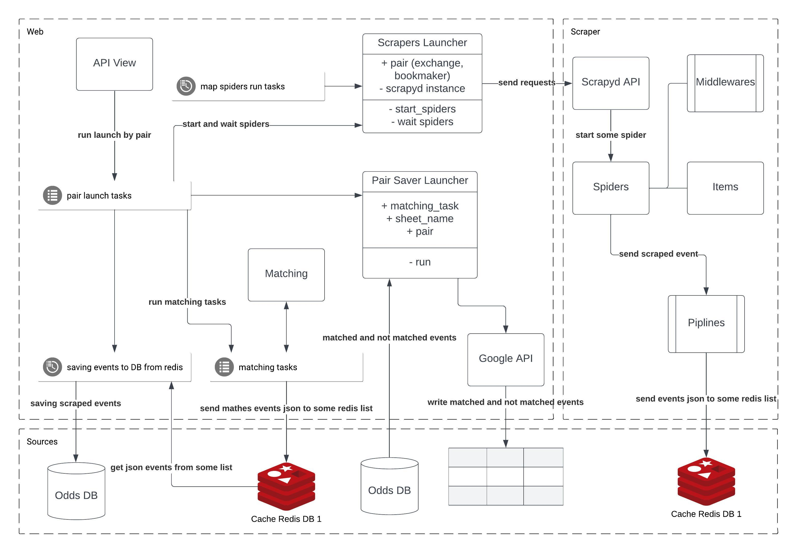

# Odds scrapers

Scraping exchange and bookmaker pairs with matching and writing data to google spreadsheet

Running requires:

* Python 3.11 (tested under Python 3.11.2)

---
# Architecture


https://airtable.com/appY4cBuQ2oyzEKmZ/tbl1QfinjooIp3bv1/viwU8AQlv9CAX2XnI?blocks=hide
###### Web
* API View - fast api implemented in main.py file
* Scrapers Launcher - class located in managers.launchers for launching and interacting with the scraper
* Pair Saver Launcher - class located in managers.launchers for extracting, filtering and saving to google spreadsheet
* Matching - module for matching one element with a list, to find the best similarity value
* Google API - module for interacting with google spreadsheet api
###### Celery tasks 
* pair_launch - task for custom launch of scrapers, matching and saving events
* matching_exchange_event - task to start the exchange event mapping in the bookmaker_events list. 
After a successful match, sends the data to the redis list matched_events_to_save
* saving_items_to_model_from_redis_list - task of writing events in the specified table model in a batch pulling data from the redis list in the form of json
and in this task, the path to the model for its import is sent and imported inside the task.
This task is also called every two seconds to save the matched data to the MatchesEvent model
* update_spiders_maps - task that runs on time to update bet99_map
###### Scrapers
- spiders:
    * bet99_map - spider for crawling filtering subcategories data to bet99_subcategories_to_parse.json file from site bet99.com
    * bet99 - spider for crawling events from site bet99.com by subcategories from bet99_subcategories_to_parse.json file
    * smarkets - spider for crawling events from site smarkets. Used scrapy-splash for js playback, because site usage websocket  
- middlewares:
    * IgnoreUrlsMiddleware - middleware class for ignoring urls by list URLS_TO_IGNORE in spider settings 
- items:
    * EventItem - base scrapy item event
    * Exchange - inherited from EventItem which contains additional fields to save to the exchangeevent table in the database
    * Bookmaker - inherited from EventItem which contains additional fields to save to the bookmaker table in the database
- pipelines:
    * DefaultValuesPipeline - pipeline for filling default fields for EventItem
    * RedisListPipeLine - pipeline for saving scraped item to redis list
    * PostgresPipeline - pipeline for saving scraped item to db (not used, after adding RedisListPipeLine)

---
# Setting up Before the beginning
### Create .env file in base directory and add credentials.json from google account
> :warning: **Required!**
```text
    .
    ├── ...
    ├── Base dir
    │   ├── web     
    │   │   ├── static
>>> │   │   │   └── credentials.json
    │   │   └── ...
    │   ├── scrapers
    │   │   └── ...
>>> │   ├── .env      
    │   ├── .env-example          
    │   ├── docker-compose.yml
    │   └── ...
    └── ...
```
---

### Docker
Config 
```bash
docker-compose config
```
Build
```bash
docker-compose up -d --build
```
View containers
```bash
docker-compose ps
```
Logs
```bash
docker-compose logs -f 
```
---
### Example launch 
```shell
>>> from tasks import pair_launch
>>> pair_launch.delay(sheet_name='SomeSheetName', exchange='smarkets', bookmaker='bet99')
```

---
### Local Installing Dependencies

```bash
pip install -r ./web/requirements.txt && pip install -r ./scrapers/requirements.txt
```
